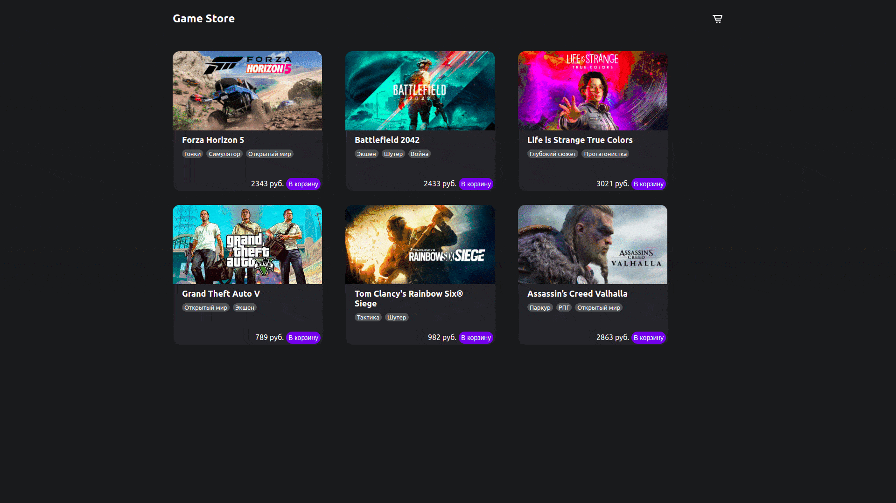

# Приложение Games Store
Реализует добавление игр в корзину, подсчет итоговой суммы, удаление из корзины как в самом меню корзины, так и из раздела со списком игр. При нажатии на обложку можно увидеть полную информацию об игре и посмотреть её трейлер из YouTube.
###### React, Redux

## Start locally
1.Install all the dependencies. Use: npm install

2.Use npm start to start locally at localhost
